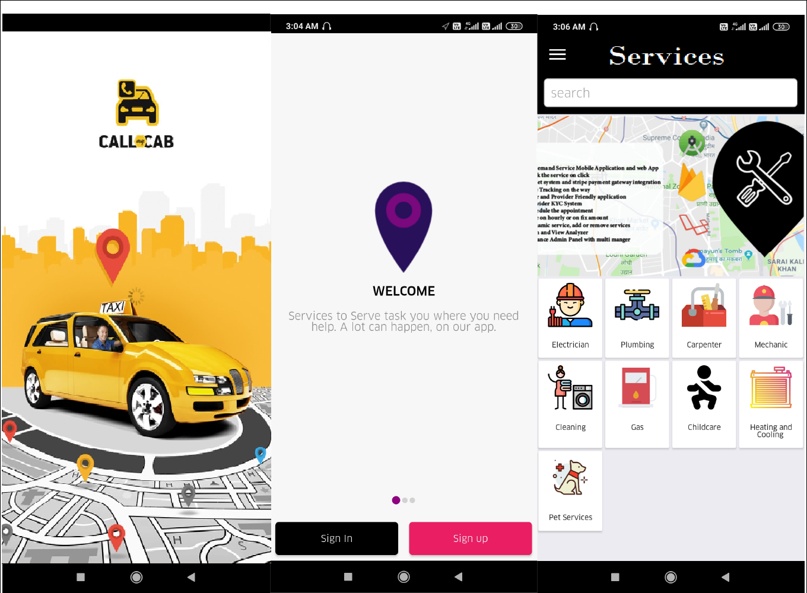
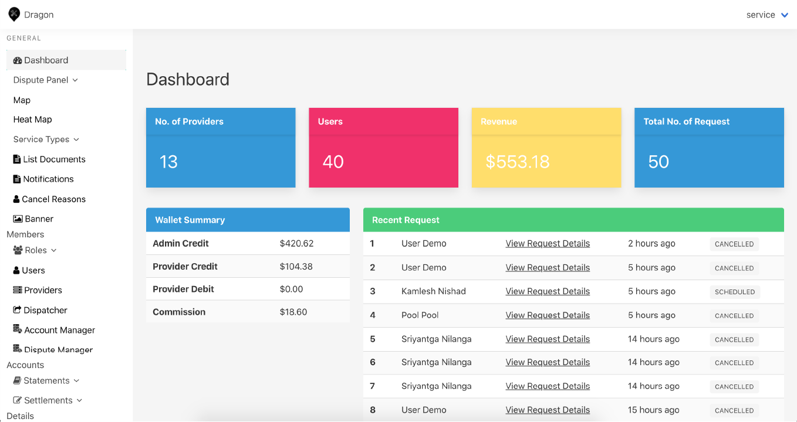
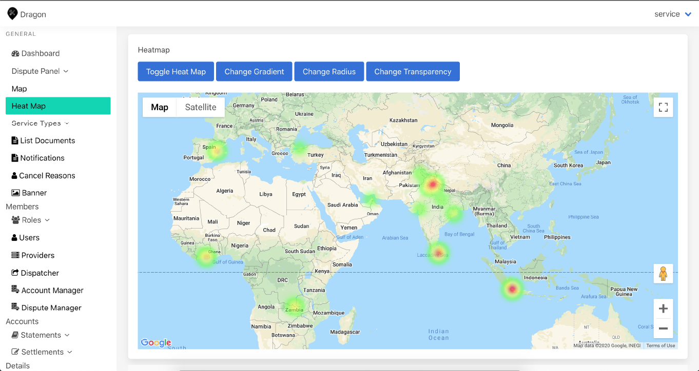
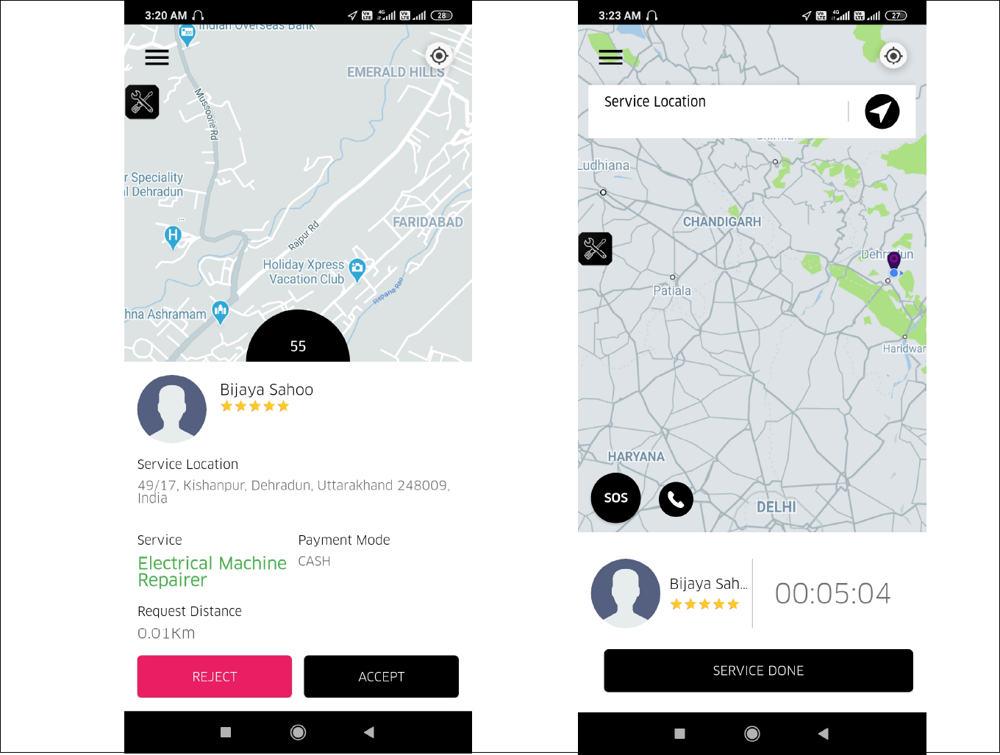

# UbanClap-Android

This app is On-demand service booking app, this is completed app in native source code for Android that help you build On-demand service booking app on smartphones. Everyone can be a Customer (task requester). User can Signup and Provider get (task receiver) after being approved by admin. Customer chooses task types, pickup location and destination location then sends requests. Near Provider will receive request then accept the Task. This app can use for any kind of services: handyman, delivery, babysitting, repairs, install, delivery etc. Admin can define each service and rate.

## Screenshot

